# 🛡️ Unviber: The Sobriety Test for Vibe Coding

> **We love GenAI speed, but "Vibe Coding" often skips security best practices.**

Unviber handles the dirty work. It acts as a gatekeeper for your Pull Requests, using advanced LLMs to detect hard-to-find compliance issues (PII leaks, auth flaws, and hardcoded secrets) that humans—and "vibes"—might miss.

---

## 🚀 How It Works

1.  **Install the App:** Add Unviber to your repository.
2.  **Open a PR:** Work as usual. No extra commands needed.
3.  **Instant Review:** Receive a compliance review comment on your PR immediately.
4.  **Take Action:** Decide to fix issues with one click or dive deeper to understand the vulnerability.

---

## 🏗️ Event-Driven Architecture

Unviber is designed as a **reactive system**. It does not poll for changes; it sleeps until GitHub wakes it up via a Webhook.

```mermaid
sequenceDiagram
    participant Dev as 👨‍💻 Developer
    participant GH as 🐙 GitHub
    participant Bot as 🤖 Unviber Bot
    participant AI as 🧠 Gemini 3.0/LLM
    participant DB as 🗄️ Supabase

    Dev->>GH: Open Pull Request
    GH->>Bot: Webhook (pull_request.opened)
    Bot->>DB: Fetch Config (Model/Rules)
    Bot->>GH: Fetch File Diffs
    Bot->>AI: Analyze Code + Security Rules
    AI-->>Bot: Return Vulnerability Report
    Bot->>GH: Post Review CommentThe 
```

## Automation Flow
1.  **Trigger (`pull_request.opened`):** The process begins strictly when a user opens or synchronizes a Pull Request. We do not listen for comments or mentions to initiate a review, ensuring zero noise.

2.  **Payload Processing (`/bot`):** Receives the pull_request payload with context.
* Authenticates as the GitHub App Installation.
* Fetches specific file diffs to minimize context window usage.

3.  **Analysis (Gemini 3.0 or Others LLMs):** Diffs and Security Rules are sent to the LLM. The model identifies PII leaks, hardcoded secrets, or compliance breaches (GDPR, SOC2).

4.  **Response:** The bot formats the findings and posts a structured review back to the PR using the GitHub REST API.

## 🧩 Component Details
#### 1. The Bot Service (/bot)
Tech: Node.js, Probot.

Role: The core automation engine.

Responsibilities:

Listens for pull_request events via Webhooks.

Authenticates securely as a GitHub App.

Constructs security-focused prompts and interacts with the LLM.

#### 2. The Web Dashboard (/web-app)
Tech: Next.js.

Role: UI for onboarding and configuration.

Responsibilities:

Handles the "Post-Install" redirect flow.

Allows users to configure the AI Model (e.g., Gemini 3.0 Pro vs. Flash) and temperature settings.

Provides documentation and usage guides.

#### 3. The Database (packages/db)
Tech: PostgreSQL (Supabase), Prisma.

Role: Persistence layer shared between Bot and Web App.

Data Privacy:

We store Installation IDs and User Preferences.

🛑 _We DO **NOT** store code. All analysis is ephemeral to comply with data privacy best practices._

#### 4. AI Engine
Tech: Google Gemini 3.0 API.

Role: The intelligence layer. Analyzes snippets specifically for GDPR, LGPD, and SOC2 compliance violations.